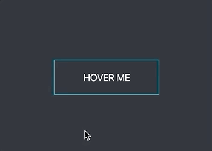

#### 闪光按钮的效果：鼠标悬浮按钮上时一道光从左到右划过去。

用渐变来模拟那道光，通过 `transform: translateX()` 将其平移至右边。

但这样明显不对啊，这光为啥能被看见呢？不应该把它给“挡”起来吗？

于是乎，给按钮加上 `overflow: hidden`，光在按钮外的位置时就被隐藏起来了。

### 这就是 overflow 障眼法的力量 :)

效果图：  
